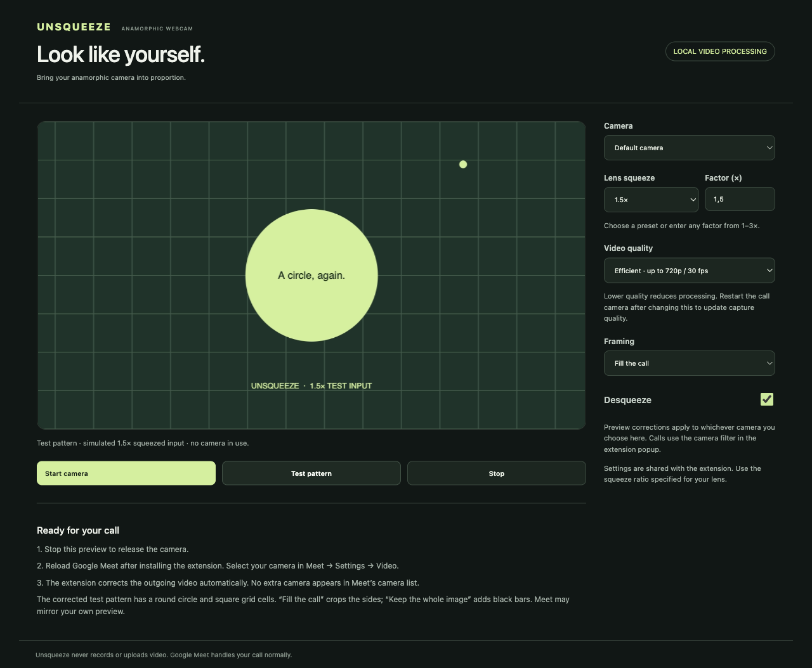

# Unsqueeze

**Natural proportions for anamorphic webcams in Google Meet.**

Unsqueeze is a small Chrome extension that corrects squeezed camera video **before other people in your call see it**. It works with the camera feed Chrome already recognizes, without tying you to a camera or lens brand.

**[Download Unsqueeze for Chrome](https://github.com/RamonLinares/unsqueeze/releases/latest/download/Unsqueeze.zip)** · [Installation guide](docs/INSTALL.md) · [Report a problem](https://github.com/RamonLinares/unsqueeze/issues)



## Install in about two minutes

No terminal, Git, Node.js, Python, or build step is needed.

1. **[Download Unsqueeze.zip](https://github.com/RamonLinares/unsqueeze/releases/latest/download/Unsqueeze.zip)** and unzip it. On Windows, choose **Extract All**; on macOS, double-click the ZIP.
2. Move the extracted **Unsqueeze** folder somewhere permanent, such as Documents. Keep it there while the extension is installed.
3. Type **`chrome://extensions`** into Chrome’s address bar and switch on **Developer mode** at the top right.
4. Click **Load unpacked**, then select the **Unsqueeze** folder containing `manifest.json`. Select the folder, not the ZIP or an individual file.
5. Pin **Unsqueeze** from Chrome’s puzzle-piece Extensions menu, then **reload any open Google Meet tabs**.

The download includes **START-HERE.html** with the same instructions. Chrome uses its manual extension-installation flow because this project is distributed through GitHub, not the Chrome Web Store. [Google’s instructions](https://developer.chrome.com/docs/extensions/get-started/tutorial/hello-world#load-unpacked).

If you downloaded GitHub’s **Source code** archive instead, load its **extension** subfolder. The ready-to-use **Unsqueeze.zip** download above is the simpler option.

## Use it in your call

1. Connect your camera using the webcam/USB/capture setup that already works in Chrome.
2. Click **Unsqueeze** in the toolbar. Leave **Desqueeze video** on and choose your lens’s squeeze factor.
3. In **Google Meet → Settings → Video**, select your normal camera. No new virtual-camera device is added.

**Other participants receive the corrected video.** A mirrored self-preview in Meet is normal and does not undo the correction.

Choose a preset—**1×, 1.25×, 1.33×, 1.5×, 1.6×, 1.8× or 2×**—or type a custom factor from **1× to 3×**. The preset and number stay in sync.

| Setting | What it does |
| --- | --- |
| Fill the call | Corrects proportions and crops equal amounts from the sides. |
| Keep the whole image | Preserves the full image with black bars above and below. |
| Efficient · 720p / 30 fps | Default balance between image quality and processing load. |
| Low power · 360p / 24 fps | Uses a smaller, less demanding image. |
| Source quality | Keeps the incoming resolution and frame rate; uses more resources. |
| Camera name contains… | Limits correction to a camera whose name contains the text you enter. |

Quality limits are maximums, not promised camera resolutions. Ratio and framing update live. After enabling correction, changing the camera filter, or changing capture quality, turn Meet’s camera off and back on.

**Using a normal lens or laptop webcam?** Turn correction off, select 1×, or use a camera-name filter to limit it to your anamorphic setup.

## Try it without a camera

Open **Unsqueeze → Open camera preview → Test pattern**. Set the factor to **1.5×**: the circle should be round and the grid cells square. At 1×, the squeezed ellipse becomes visible.

You can also start your real camera in the preview. **Stop the preview before using the camera in a call.** The preview is designed to stop when Chrome reports that its tab is hidden; Meet calls continue in the background.

## Update or remove

**Update:** download the latest ZIP, extract it, and replace the contents of the existing Unsqueeze folder while keeping that folder at the same path. Open `chrome://extensions`, click **Reload** on Unsqueeze, then reload Meet. Settings are retained. GitHub installations do not update automatically.

**Remove:** open `chrome://extensions`, choose **Remove** on Unsqueeze, then reload Meet. You can then delete its folder.

Avoid installing two copies: both may process your camera video.

## Need help?

| Problem | What to try |
| --- | --- |
| “Load unpacked” is missing | Turn on Developer mode in `chrome://extensions`. Managed work/school browsers may restrict it. |
| “Manifest file is missing” | Unzip first and select the folder that directly contains `manifest.json`. For a source archive, choose `extension`. |
| Still squeezed | Reload Meet, check the selected camera and Unsqueeze’s camera filter, then toggle the call camera off/on. |
| Camera looks too wide | Match the lens’s actual squeeze factor. Do not desqueeze twice if another utility already corrects it. |
| Camera unavailable | Stop the preview and close other apps using the camera. Check Chrome and operating-system camera permissions. |
| Computer runs hot | Choose Low power, restart the call camera, and close unused preview tabs. Meet and other apps can also cause heat. |

See the [step-by-step installation guide](docs/INSTALL.md) or [open an issue](https://github.com/RamonLinares/unsqueeze/issues). Include your Chrome version, operating system, camera/capture setup, factor, and what happened. Never attach private call recordings or personal information.

## Compatibility and privacy

Designed for **Google Meet in desktop Google Chrome**. Tested on macOS with synthetic video and a real anamorphic-camera setup. Camera and lens brands are not restricted, but every device combination has not been tested. Other browsers, operating systems, and call services have not been verified. This does not provide a system-wide camera for desktop calling apps.

Video processing runs on your device. Unsqueeze has no server, recording, analytics, or upload service. Meet still transmits your call normally. Preferences and the last camera-status message are stored locally. [Privacy details](PRIVACY.md).

## For developers

The entire extension lives in `extension/`. You can load that directory directly in Chrome. No npm dependencies are needed.

```sh
# Node.js 18+ for the dependency-free geometry/settings tests
node --test tests/geometry.test.cjs

# Python 3.9+ to create the downloadable extension
python3 scripts/build.py
python3 scripts/check_package.py
```

The build creates `Unsqueeze.zip` and a versioned copy, with one top-level `Unsqueeze` folder. Generated archives, local browser profiles, and test outputs are excluded from Git.

Browser/video test instructions and implementation notes are in [Technical details](docs/TECHNICAL.md). [Performance measurements](PERFORMANCE.md) distinguish rendering-work reductions from actual CPU or temperature measurements.

Bug reports and focused pull requests are welcome. For UI changes, include a screenshot using the test pattern rather than a private camera image. For video changes, verify frame proportions, camera on/off, cleanup, and the WebRTC loopback before submitting.

## License

[MIT](LICENSE). You may use, modify, and redistribute Unsqueeze, including commercially, under that license.
